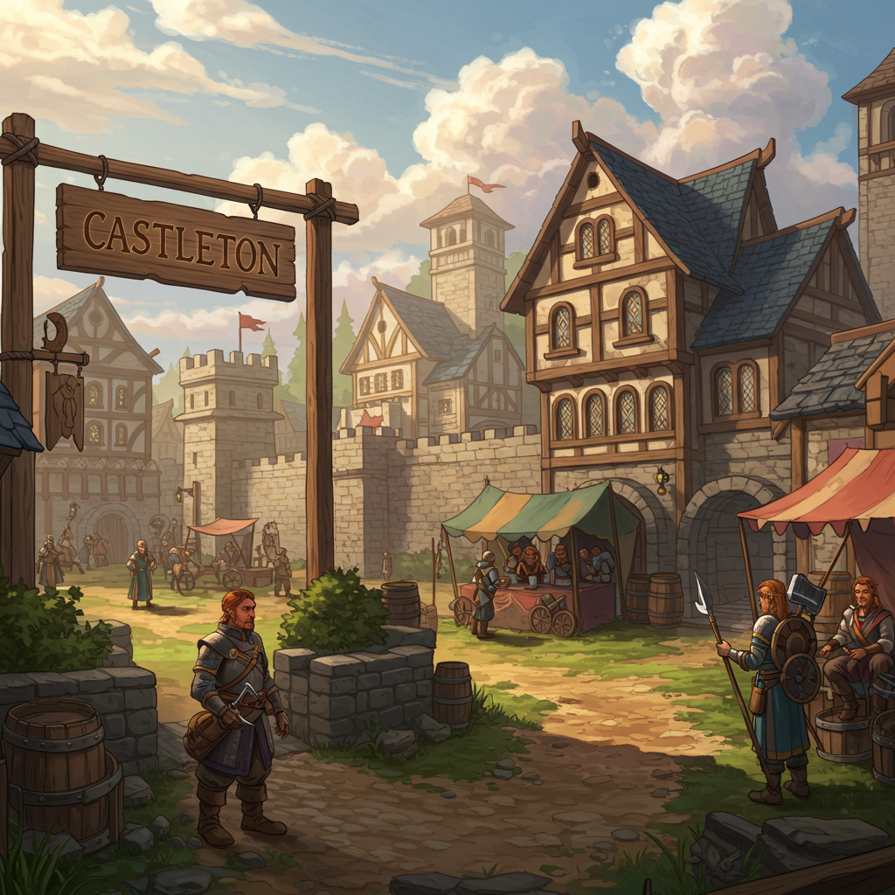
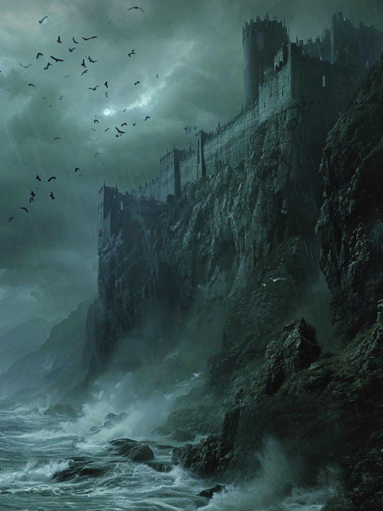

# Castleton

## Descripción general

Un asentamiento al noreste de Lockleed, a aproximadamente una semana de viaje. El grupo pasó por aquí al principio de la campaña y fue contratado por Linus Larabee para limpiar una mansión en los acantilados.

## Lugares clave

### The Cloak & Stagger

Un bar. El cantinero es Billy. Conocido como punto de encuentro para aventureros y enanos. El grupo compró Skull Splitters para tres enanos aquí y conoció a Linus Larabee.

### The Cliffside Manor

Una gran mansión en los acantilados sobre Castleton, comprada por Linus Larabee (legalidad en disputa). El grupo la limpió de gnolls y semi-orcos en la Sesión 1.

**Distribución de la mansión (explorada):**
- Exterior/entrada: custodiada por gnolls y semi-orcos
- Torres de guardia
- Dormitorios (escarabajo de fuego encontrado debajo de una cama)
- Sala de la fuente (trampa Water Weird, desactivada al destruir el espejo del techo)
- Pasajes secretos (encontrados por Fraxiga)
- Habitación con un semi-orco que tenía la escritura + una escritura falsificada
- Habitación donde se encontró el esqueleto de un Thief muerto (Frank), medio arrastrado dentro de un agujero en el suelo
- Ascensor que lleva a los niveles de mazmorra/cueva inferiores (aún no explorados)

## Imágenes

## PNJs conocidos

- **Linus Larabee** — intermediario, opera aquí; ver npcs/linus-larabee.md
- **Billy** — cantinero en the Cloak & Stagger
- **Ironpants (Nicholas), Dragonbailt (Tavin), Happy (Kim Hammerhand)** — tres enanos con base aquí; ver npcs/dwarves-castleton.md
- **Grell Hammerhand** — enano tuerto, asociado con esta zona; ver npcs/grell-hammerhand.md
