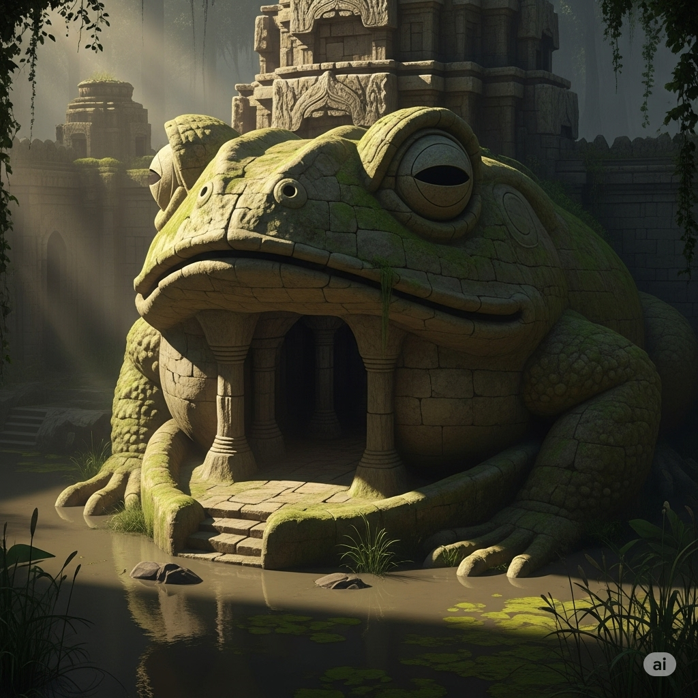

# Croaking Fane

## Descripción general

Un complejo de templos en un pantano. La entrada está construida dentro de o a través de la boca abierta de una enorme estatua de rana de piedra, cubierta de musgo. Antiguas tallas de piedra visibles al fondo. Ubicado dentro de o adyacente a tierras pantanosas.

## Información conocida

- Este es el sitio del módulo 2 en la campaña (The Croaking Fane, DCC). El grupo ya lo ha limpiado.

## Imágenes

