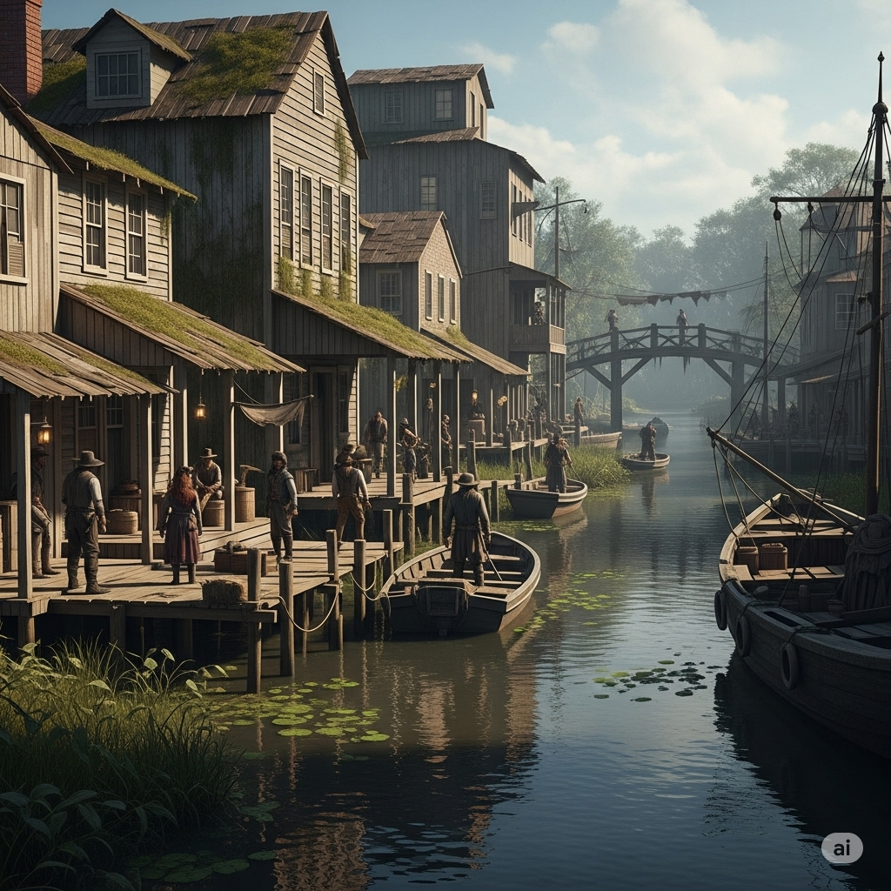
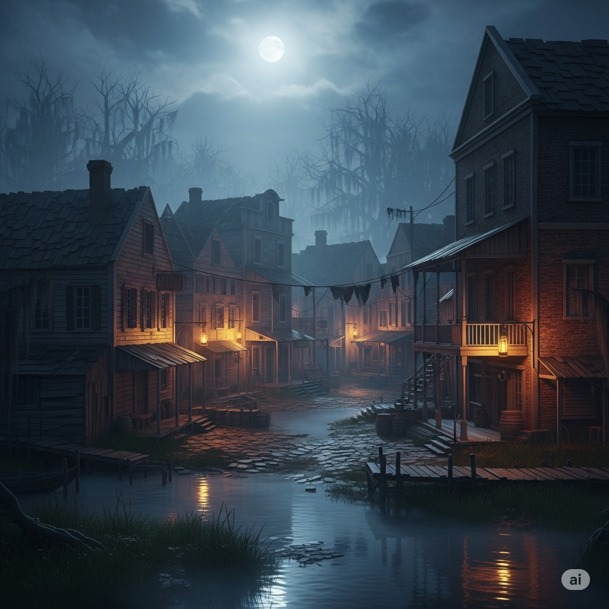

# Linea Rubra

## Descripción general

Un distrito costero o establecimiento dentro o adyacente al Kingdom of the Rat. El nombre se traduce como "Línea Roja." Dos vistas proporcionadas por el DM: una escena de canal/muelle diurna y una calle inundada con luz de luna por la noche.

## Información conocida

Reglas de la casa publicadas en el establecimiento:
- Sin crédito
- Sin perros
- Sin Elfs

**Personal conocido:**
- **Black Pete** — camarero albino

**Bebidas:** Goblin Piss (1 cp)

Ver también: locations/kingdom-of-the-rat.md

## Imágenes

