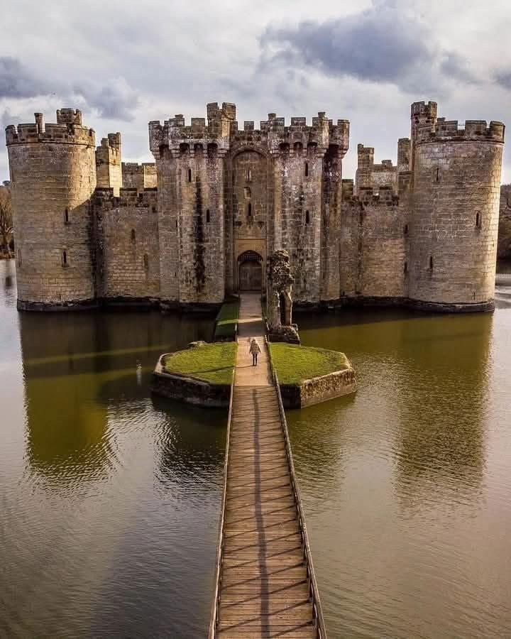
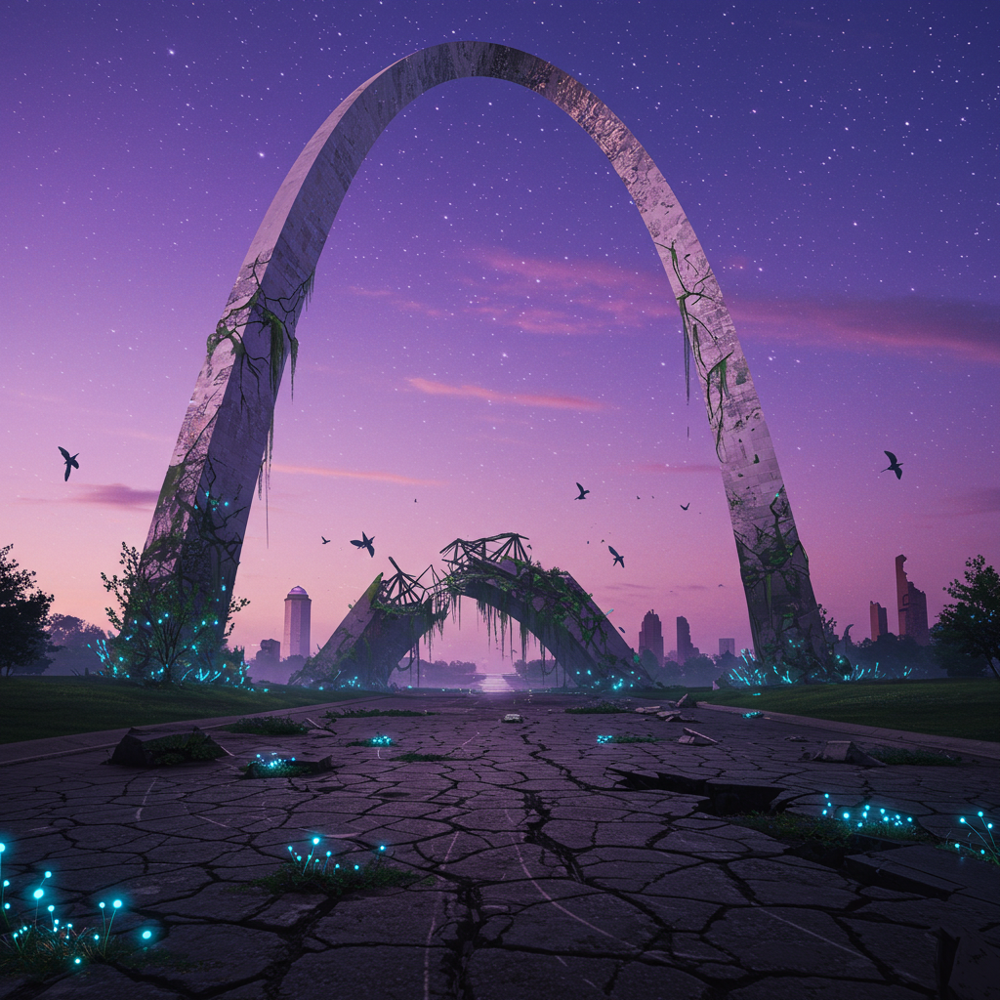
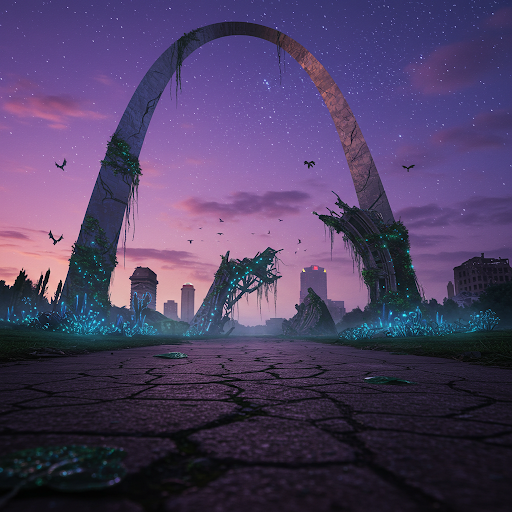

# Lockleed

## Descripción general

Lockleed es la ciudad de inicio del grupo y la ubicación del Codex of Infinite Wisdom. Se asienta sobre el río Shipley. Un sistema de balsa carcelaria envía prisioneros condenados río abajo desde aquí hasta un lugar llamado Nawlins — aproximadamente la mitad sobrevive el viaje.

## Lugares clave

**Nemmerle's Manor:** Grande pero en decadencia. Hogar del sabio Nemmerle, quien guarda el Codex of Infinite Wisdom. El grupo fue reclutado aquí por Alton al inicio de la campaña.

## Conexiones conocidas

- El río Shipley atraviesa o pasa cerca de Lockleed. Seguirlo hacia el sur lleva al río Misery; desde ahí, al noroeste lleva a las Montañas del Mineral Perdido.
- Viajar al noreste aproximadamente una semana llega a Castleton.

## Imágenes

## Importancia en la campaña

- El Codex of Infinite Wisdom es custodiado aquí por Nemmerle.
- Una piedra lunar fue enterrada aquí por el grupo como ancla de portal de regreso para el Moongate de A.R.T.E.M.I.S.
- Miembros de los USAF Warriors (específicamente Alton) operan en esta zona.
