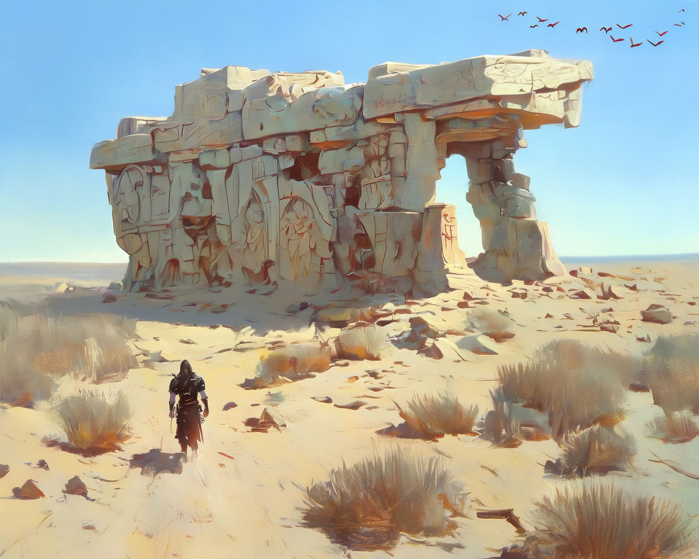

# Nemmex Desert

## Overview

An arid desert region. Contains ancient ruins — carved stone archways and collapsed structures with figural reliefs. Birds of prey circle overhead. A lone figure was seen approaching the ruins.

## Known Info

- Valen was mapping the forest on the edge of the Nemmex Desert when he found the spider amulet that began his corruption.
- No confirmed party travel to this region yet.

## Images

