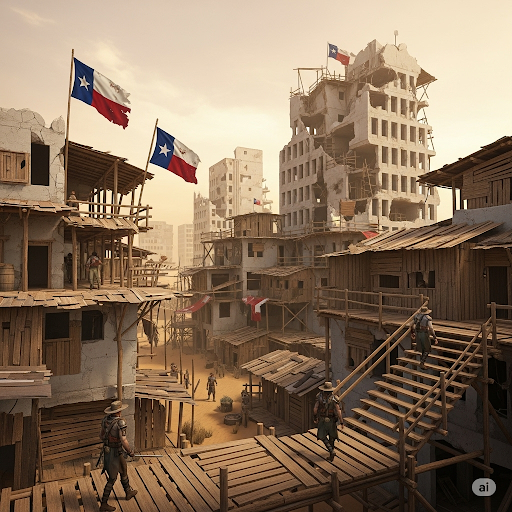
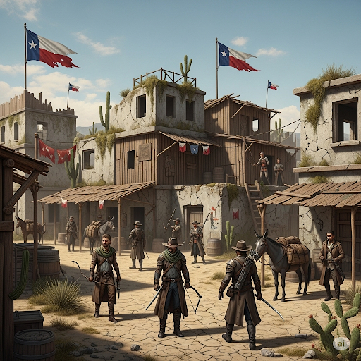
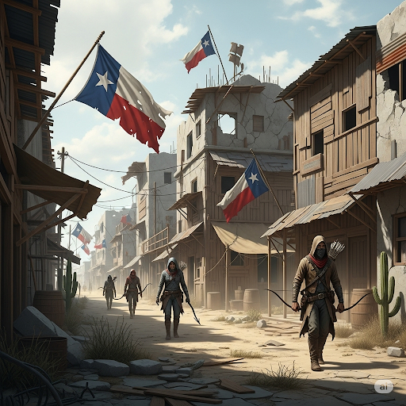
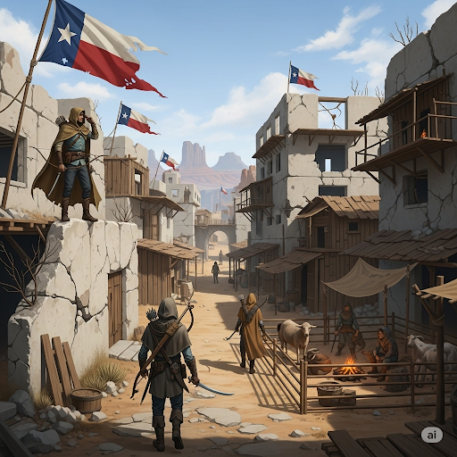
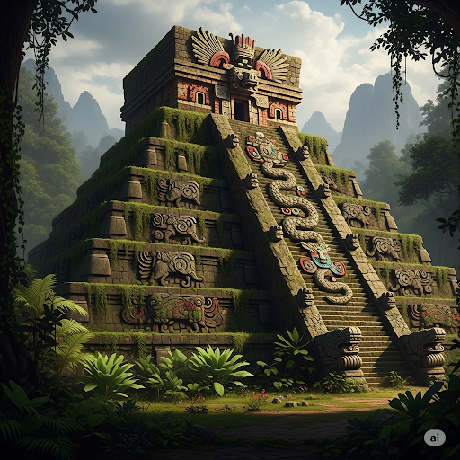

# Stella Solis

## Descripción general

Un asentamiento posterior al Reckoning en la región de Texas. Dirigido por Jefferson Thomas (Ranger de Tayhas). Una bandera del estado de Texas ondea visiblemente desde las ruinas de un edificio de varios pisos dañado. El asentamiento está construido dentro de o alrededor de una estructura urbana arruinada anterior al Reckoning.

## Información conocida

- Jefferson Thomas lidera el asentamiento y ofrece recompensas; ver npcs/jefferson-thomas.md.
- Raynor viaja regularmente entre Stella Solis y Two Sons.
- El Templo de la Serpiente es una estructura separada cercana (o dentro de la misma zona) — ver imágenes.

## Lugares clave

### El Templo de la Serpiente
Estructura de templo antiguo dentro de o cerca de Stella Solis.

## Imágenes

