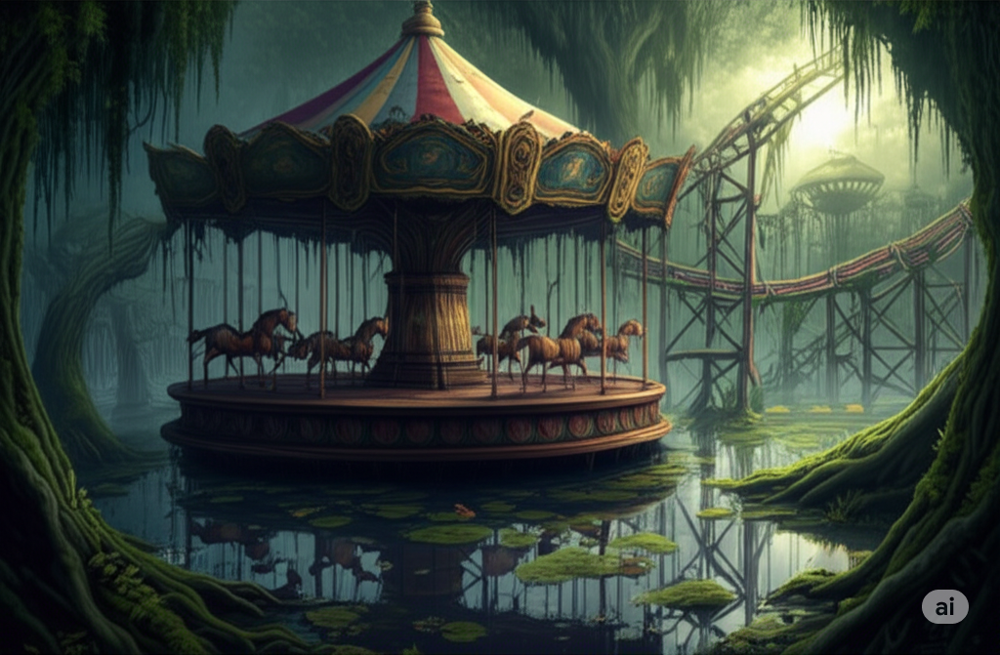
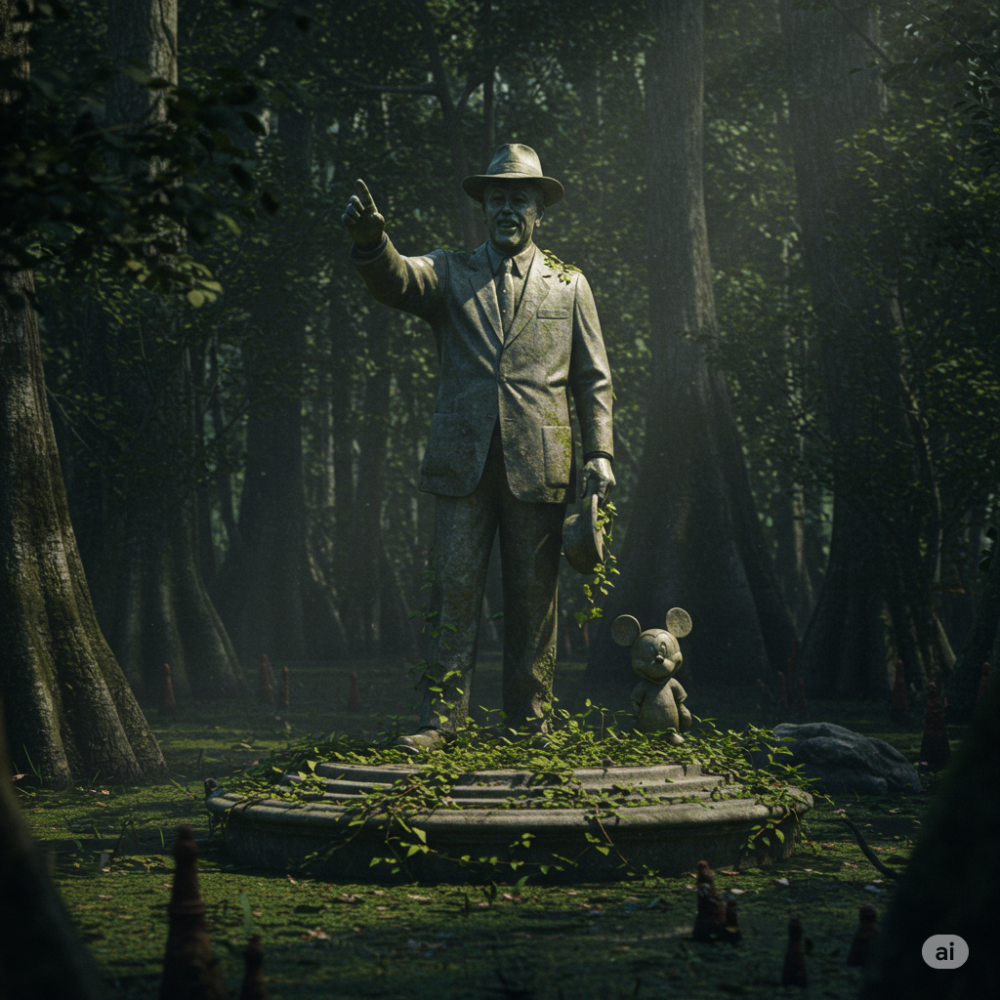
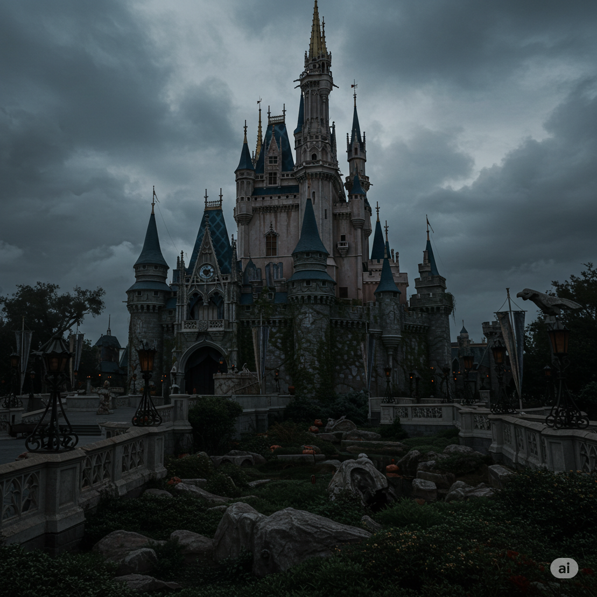
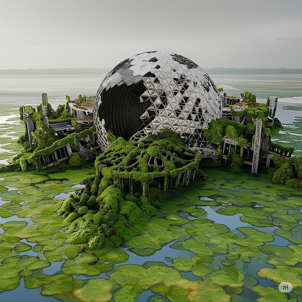
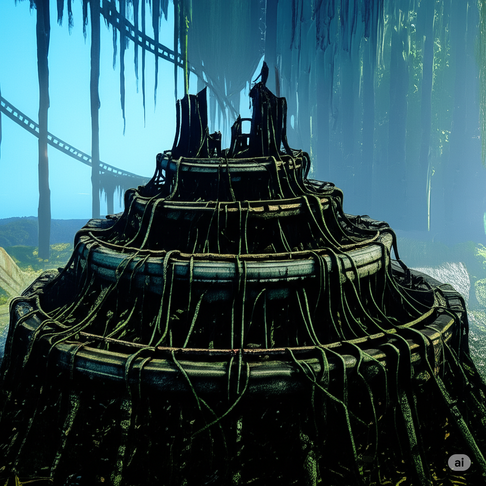

# Walter's Kingdom

## Descripción general

El Kingdom of the Rat, gobernado por el Rey Walter. Ubicado en una región pantanosa del sureste. El reino ocupa las ruinas inundadas de un complejo de entretenimiento anterior al Reckoning — un parque temático. Los puntos de referencia clave incluyen un carrusel en funcionamiento (o semi-funcionamiento), ruinas de una montaña rusa invadidas por vegetación pantanosa, y una gran estatua de piedra del fundador del parque: un hombre trajeado con sombrero, con la mano levantada, acompañado de una pequeña figura de ratón a su lado.

Walter se refiere a su dominio como "el pantano más lujoso."

## Información conocida

- El Rey Walter gobierna desde aquí.
- El barco de Taelendra opera dentro de o alrededor de esta zona — ella capitanea la operación pesquera de Walter.
- Se le ofreció al grupo un trato: limpiar a los Lizard Men del pantano a cambio de la liberación de Taelendra.

Para detalles completos de la campaña (PNJs, cultura, situación con los Lizard Men, centauros, peligros del pantano): ver locations/kingdom-of-the-rat.md

## Imágenes

