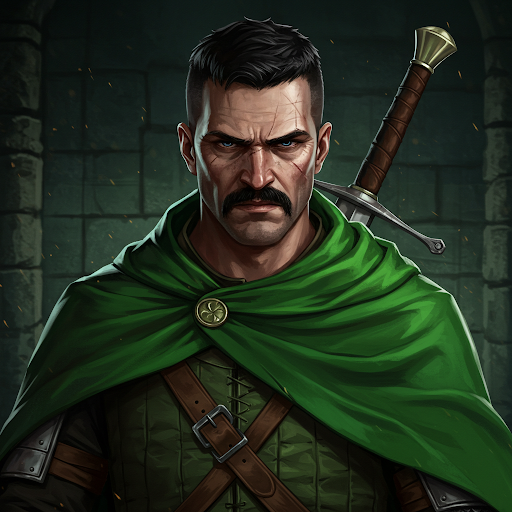

# Alton

## Role
USAF Ranger

## Affiliation
USAF Warriors

## Description
Alton wears a cloak bearing the USAF insignia: an eagle on a circle with three stars. Motto: *"integritas auxilium optimum."*

He served as Nemmerle's field agent — by his own account, he has worked with the sage for approximately 20 years.

## Known Info

- Recruited the party to seek the four Noldori glyph-bearers for Nemmerle and the Codex.
- Presented the party with the ARTEMIS Moongate disc (PROJECT A.R.T.E.M.I.S., North Central Positronics, STL).
- Sent OJ Simpson a personal recruitment letter addressed to "Orenthal," inviting him to join the USAF Warriors. Meeting point: the Crooked Oak by the Shadowfen, first twilight after the next new moon.
- Briefed the party on the four regions of Newhon before they departed Lockleed.
- Knows: Raynor, Linus Larabee, Grell Hammerhand, Jefferson Thomas.

## Status
Active. Location currently unknown — not traveling with the party.

## Images

