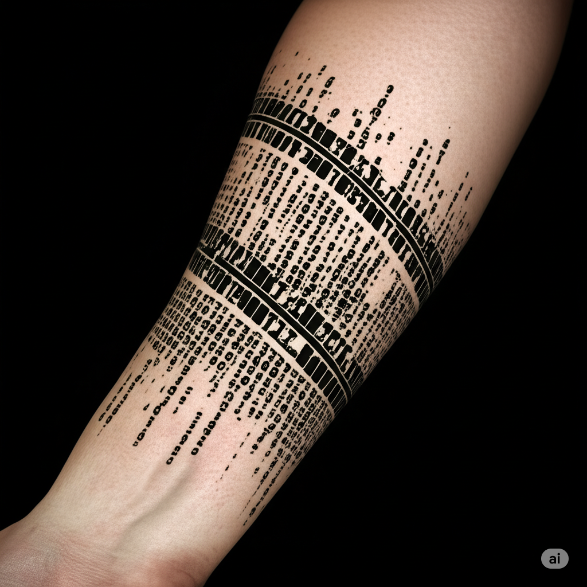

# Commander Swan (Voronwë)

## Rol
Uno de los cuatro portadores del glifo Noldori; comandante de los Silverwood Sentinels; líder de Threshold

## Ubicación / Afiliación
Threshold / Silverwood Sentinels

## Descripción
Elfo Noldori. Masculino. Cabello plateado. Se hace llamar "Commander Swan" o "Voronwë."

Maldito — no puede hablar ni escribir su propio nombre ni el de otros. De ahí que use el nombre "Swan."

## Información conocida

**Threshold:**
Swan fundó o rebautizó el asentamiento de Threshold (anteriormente Whitman). Sobre el nombre: *"Threshold era originalmente Whitman. Quería cambiarlo, hacerlo más grande que una persona. Las personas van y vienen, pero las ideas; las ideas persisten. Este es el umbral de la civilización. Aquí es donde la ley se planta ante el caos. El bien ante el mal. La civilidad ante la barbarie."*

**Silverwood Sentinels:**
Swan comanda o comandó esta fuerza. Tras la limpieza de las Cuevas Susurrantes por parte del grupo y la liberación de los rehenes, Swan les agradeció personalmente y ofreció el apoyo continuo de los Elfos del Silverwood. También le escribió a Linus Larabee proponiéndole una ruta comercial fluvial entre las áreas del Silverwood y Castleton como alternativa más segura a las caravanas de carros.

**El glifo:**
Uno de los cuatro Noldori que porta un glifo de traducción para el Codex of Infinite Wisdom.

## Estado
En Threshold. El grupo ha sido dirigido a buscarlo allí.

## Imágenes

