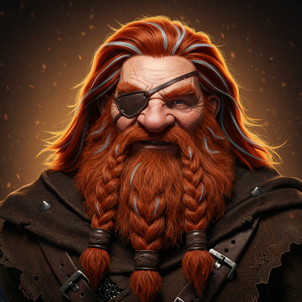

# Grell Hammerhand

## Rol
Enano; contacto regional

## Ubicación / Afiliación
Área de Castleton

## Descripción
Un enano tuerto. El apellido Hammerhand también aparece en el grupo de enanos de Castleton (Kim "Happy" Hammerhand) — posible parentesco, no confirmado.

## Información conocida

- Conocido tanto por Alton (USAF Ranger) como por Raynor.
- No se han confirmado más detalles.

## Estado
Activo. Se cree que está en Castleton o sus alrededores.

## Imágenes

