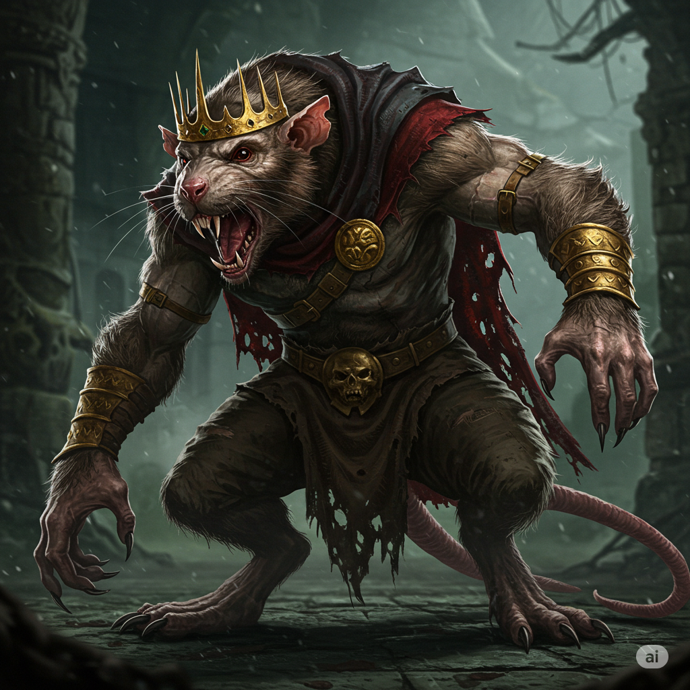
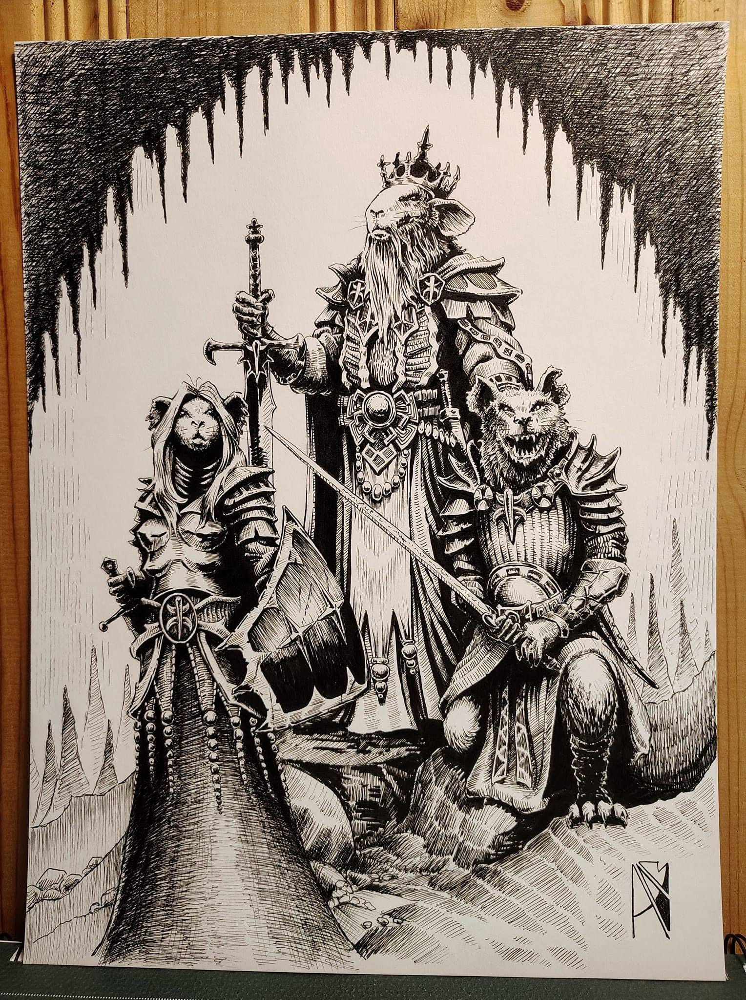

# King Walter

## Rol
Gobernante del Kingdom of the Rat

## Ubicación / Afiliación
Kingdom of the Rat (región pantanosa del sureste)

## Descripción
Un hombre-rata. Se enorgullece abiertamente de esto y se considera un ganador por ello. Su patrón de habla es divagante, autoenaltecedor y repetitivo. Se refiere a su pantano como "el pantano más lujoso."

El nombre "Walter" es un título que se aplica a cada gobernante de este reino sin importar su nombre real. El nombre real del Walter actual podría ser Jeffrey.

## Información conocida

- Retiene a Taelendra ("Tinker Belle") como "huésped involuntaria" a bordo de su barco de pesca de alta mar. Taelendra y Commander Swan son personas distintas.
- El arreglo: ella capitanea su barco a cambio de comida, agua y artículos de primera necesidad. No tiene elección — su maldición le impide que sus pies toquen tierra firme, por lo que el barco es a la vez su prisión y su única opción.
- Le ofreció al grupo un trato: eliminar a los Hombres Lagarto de su pantano, y él liberará a la elfa.
- Posee hallazgos de Old Tek que Taelendra sabotea sistemáticamente.

## Estado
Activo. Gobierna desde el pantano. El grupo no se ha enfrentado directamente a él.

## Imágenes

