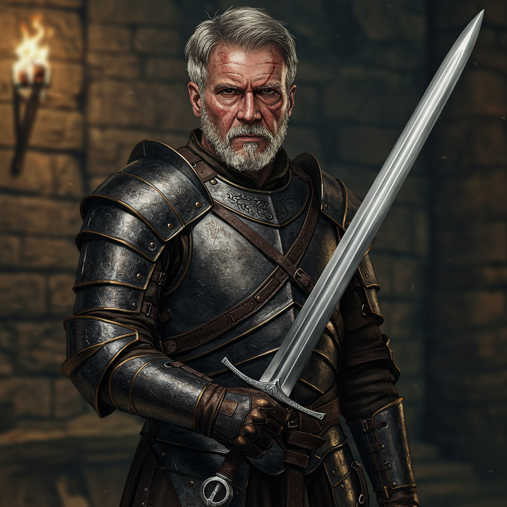

# Linus Larabee

## Rol
Intermediario; corredor de información

## Ubicación / Afiliación
Castleton

## Descripción
Humano. Se hace llamar "Double L, Give em Hell." Es un intermediario — compra y vende artículos de procedencia dudosa y sabe cosas que otros no saben. Opera desde Castleton.

## Información conocida

- Contrató al grupo para limpiar la mansión del acantilado de monstruos. Afirmó haberla comprado "legalmente."
- Recibió la escritura de la mansión (y el duplicado falsificado) del grupo tras la limpieza.
- Tiene conexiones en toda la región — conocido por Alton y Raynor.
- Recibió una carta de Commander Swan (Silverwood Sentinels) agradeciéndole haber enviado aventureros a limpiar las Cuevas Susurrantes, y proponiéndole una ruta comercial fluvial como alternativa más segura a las caravanas de carros.

## Estado
Activo. Radicado en Castleton.

## Imágenes

