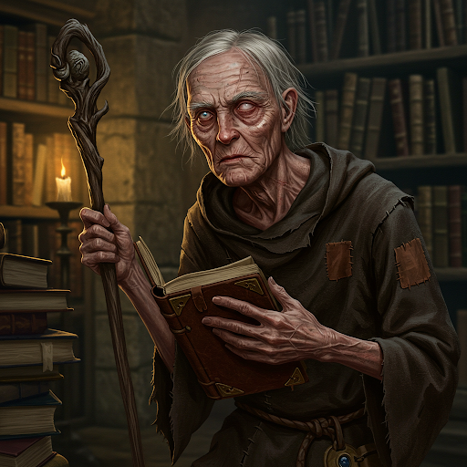

# Nemmerle

## Rol
Sabio; guardián del Codex of Infinite Wisdom

## Ubicación / Afiliación
Lockleed

## Descripción
Un sabio anciano. Amable y algo ingenuo. Su mansión en Lockleed fue en otro tiempo grandiosa; ahora se ve claramente en declive — Nemmerle ha gastado la mayor parte de su fortuna en la búsqueda del Codex.

## Información conocida

- Posee el Codex of Infinite Wisdom, al que ha dedicado su vida para hacerlo legible.
- Le explicó al grupo el sistema de glifos del Codex: cuatro glifos tatuados en cuatro estudiantes Noldori, enviados a los cuatro puntos cardinales por los Cuatro Vientos.
- Empleó a Alton (USAF Ranger) como su agente de campo durante aproximadamente 20 años.
- Permitió que el grupo consultara el Codex directamente — ninguno pudo leerlo.
- Organizó que Alton reclutara al grupo en su nombre cuando ya no podía continuar la búsqueda por sí mismo.

## Estado
Activo. Permanece en su mansión de Lockleed.

## Imágenes

