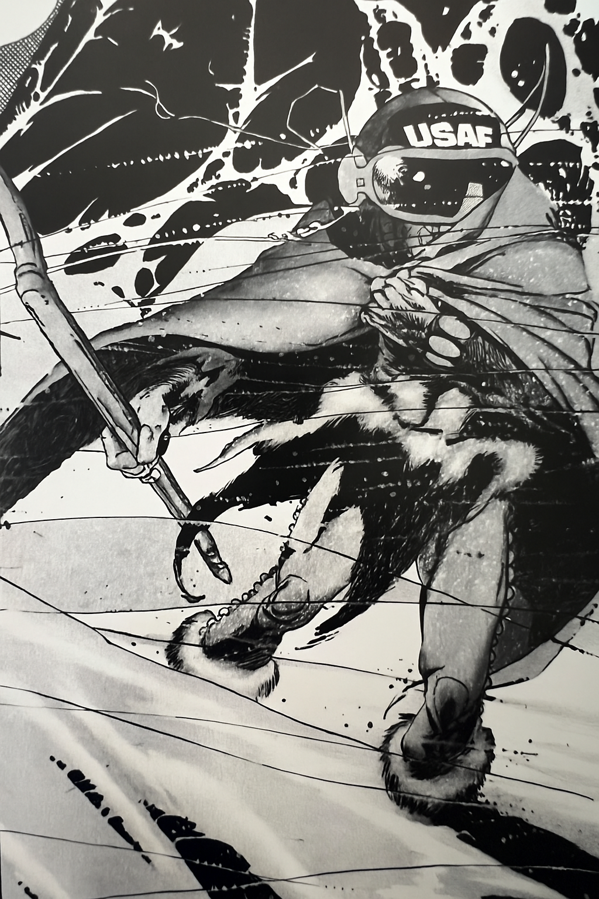

# Raynor

## Role
USAF Warrior / Ranger

## Location / Affiliation
Southern forest and northern swamps. Regularly travels between Stella Solis and Two Sons.

## Description
A ranger affiliated with the USAF Warriors. Operates in the south — forest and swamp borderlands. He is cautious about NPCs: notably, he eyes Valen's bow with visible distrust.

## Known Info

- Travels between **Stella Solis** (run by Jefferson Thomas, Tayhas Ranger — good bounties available; see locations/stella-solis.md and npcs/jefferson-thomas.md) and **Two Sons** (a free-wheeling border town).
- Discovered a scroll among Ratfolk that contains drawings of the party — someone is tracking them.
- Knows the customs for dealing with Lizard Folk:
  - Hold both hands open above your head
  - Lay your cloak on the ground
  - Place trade goods on the cloak
  - Do not haggle more than once
  - Suggested putting color bands on Burt and blood/paint lines under his eyes — with Frank the skeleton, this gives Burt the appearance of a shaman, which may help in negotiations
- Can teach fighters to switch to the Ranger class.
- Knows: Alton, Linus Larabee, Grell Hammerhand, Jefferson Thomas.

## Status
Active. Operating in the southern forest and swamp region.

## Images

