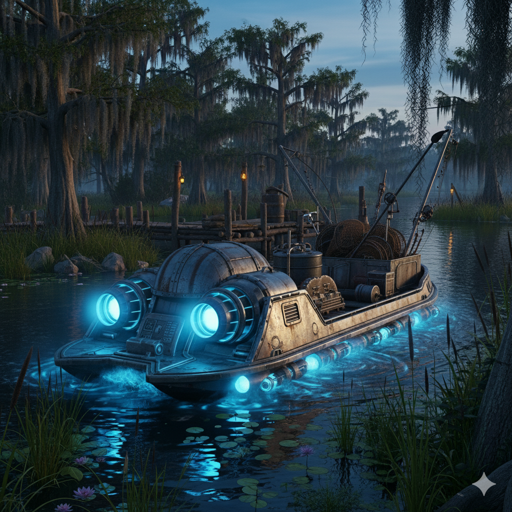
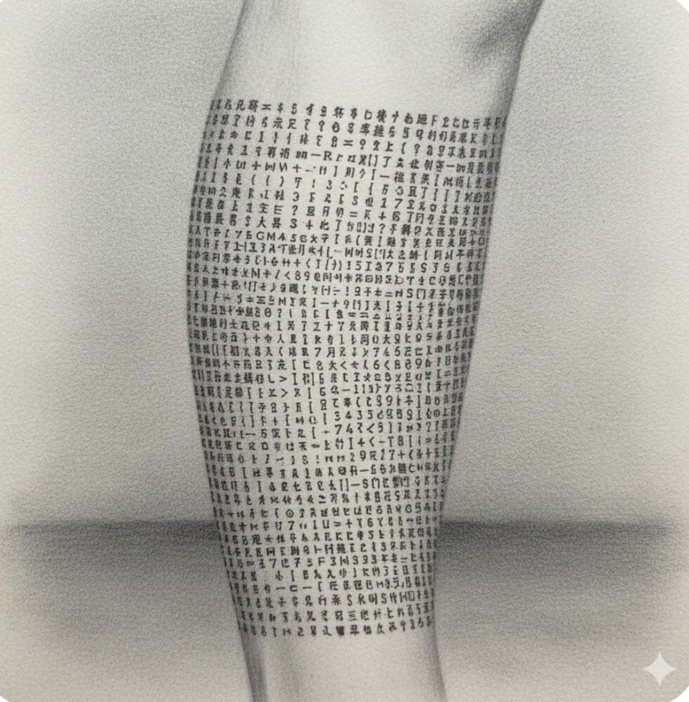

# Taelendra ("Tinker Belle")

## Role
One of the four Noldori glyph-bearers; captive captain under King Walter

## Location / Affiliation
Aboard King Walter's ship, Kingdom of the Rat

## Description
Noldori elf. Female. Silver hair. Known to King Walter as "Tinker Belle." Her curse prevents her from speaking or writing her own name or the names of others.

She is under a curse that has lasted at least 80 years: her feet cannot touch dry land. She has not set foot on solid ground since the event called "the Siege," when her master's spell deposited her in saltwater. She found a derelict vessel run aground and boarded it for shelter.

## Known Info

**The Curse:**
~80 years ago, after the Siege, her master teleported her. She landed in saltwater. An unseen force prevents her from stepping onto dry land. She has lived aboard a ship ever since.

**King Walter's Captive:**
King Walter (the ruler at the time, two kings before the current one) found her and made a deal: she captains his deep-sea fishing operation in exchange for food, water, and necessities. She is effectively imprisoned. He calls her "Tinker Belle" because of her knowledge of Old Tek.

She actively sabotages Walter's Old Tek finds whenever she can. She wants to see her brother and friends and escape his control. Walter should not have USAF or North Central Positronics access.

**The Ship:**
She rebuilt the derelict vessel using her knowledge of pre-Reckoning technology — rerouted magic engines (repulsors/ley threads), rat-powered wheels with magnetic rocks, allowing the metal ship to travel on water.

**Knowledge:**
Extensive knowledge of pre-Reckoning technology and history:
- Moongates (how they work and operate)
- Old Tek magic generally
- North Central Positronics
- New Atlantis
- ARTEMIS
- Tannhauser Gate

She can read maps and open locks.

**Rowan's Sword:**
Taelendra identified a North Central Positronics gem in Rowan's enchanted longsword. Frog idol and snake idol are associated with these gems. The gems have tiny swords that fit into sheathes on their items — **incorrect orientation ruins the magic.**

**The glyph:**
One of the four Noldori bearing a translation glyph for the Codex of Infinite Wisdom.

## Status
Captive aboard King Walter's ship. Walter has offered to release her if the party clears Lizard Men from his swamp.

## Images

