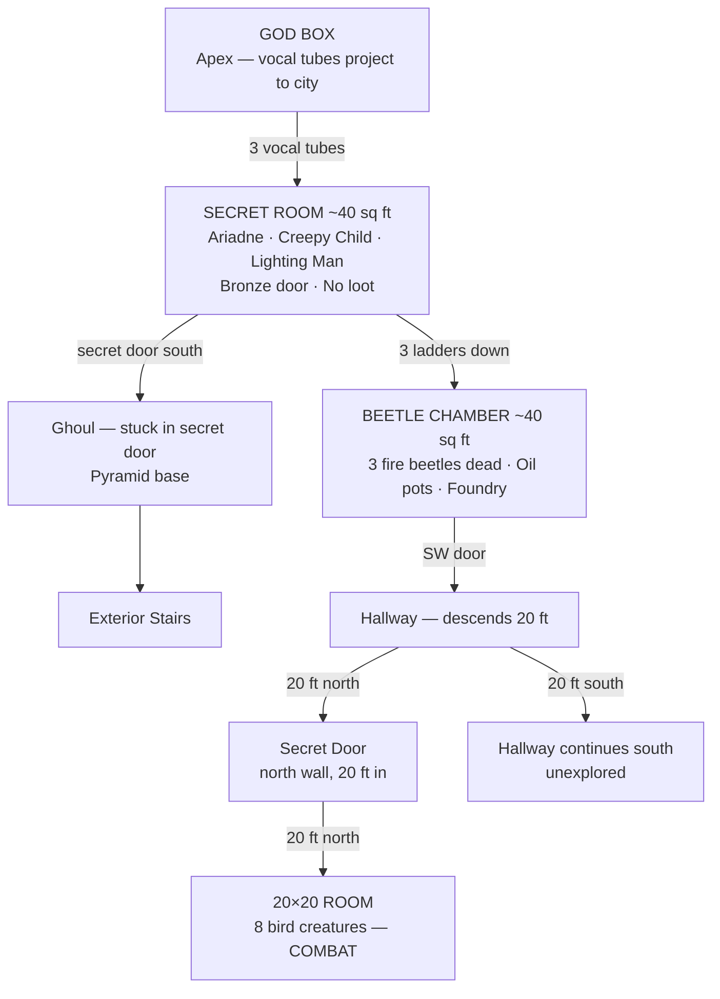

# Session ~10–11

**Date:** 2026-04-24
**Status:** In progress — being built live
**Note:** Exact session number unknown, estimated ~10–11

---

## Dungeon Overview



---

## Location: Ziggurat Interior

### Floor Plan — Upper Room (Secret Room)

```
  [god A]  [god C]  [god L]    <- apex speaker positions
     |         |        |
  +--|---------|--------|--+
  |  |         |        |  |
  | (§)       (§)      (§) |   <- left, center, right tube pillars
  | [A]       [C]      [L] |   <- Ariadne, creepy child, lighting man
  |            [B]         |   <- bronze door at center pillar
  |                        |
  +--------[S]-------------+
                ^
          secret door (leads down to ghoul)
```

**Key:**
- `(§)` — hollow tube pillar with internal ladder (x3)
- `[god A/C/L]` — apex speaker position per god, aligns with pillar below
- `[B]` — bronze door at center pillar
- `[S]` — secret door, south wall
- `[A]` — Ariadne (left pillar)
- `[C]` — creepy child (center pillar)
- `[L]` — lighting man (right pillar)

### Room Notes
- ~40 sq ft interior
- No loot
- Each tube pillar is hollow with a ladder — climb up to speak as a specific god
- Center tube = creepy child's god
- Each entity (Ariadne, creepy child, lighting man) corresponds to one tube/god
- Bronze door at center between the three pillars
- Secret door at south wall connects to interior passage down to pyramid base
- Ghoul stuck in secret door at pyramid base (below)
- Each tube has a lower door leading to a ~40 sq ft room containing a glowing beetle (x3 rooms, one per tube)

### Pyramid Cross-Section — Ziggurat Style

```
               [GOD BOX]           <- apex, projects to city
            +_____________+
            |   tier 4    |
         +--+_____________+--+
         |      tier 3       |
         |   +--[RM]---+     |     <- secret room (party is here)
      +--+   |  | | |  |    +--+
      |       \ tubes /        |   <- 3 hollow tube pillars w/ ladders
      |    tier 2     |        |
      |   [beetle chambers]    |   <- ~40 sq ft rooms at tube bases
   +--+                        +--+
   |          tier 1               |
   |           [G]                 |   <- ghoul in secret door (base)
   +___________=====_______________+
                =====
               =======
               stairs
```

---

## Entities Present

| Entity | Notes |
|--------|-------|
| Ariadne | From Session 001 |
| Lighting man | — |
| Creepy child | — |

---

## Overall Dungeon Map

### Ziggurat — Explored Areas

```
    ┌──────────────────────────────────────────+──────────────────────+──────────────+
    │                                          │                      │              │
    │                                          │                      │              │
    │ north                                    │                      [D]──────┬─────+
    │                                          +────────────[D]───────+        │
    │                                                                          │
    │                                                            +─────────────┴─────+
    └─────────┬────────────────────────[W]+------------------+   │                   │
       +──────│─────+                     |                  |   +─────┬─────────────+
       │            │                     | (§)  (§)  (§)    |         │
       │  20x20 rm  │ [S]                 |                 [E]───────[D]─────[D]────┐
       +──────│─────+                     |                  |                 │     │
    ┌─────────┤<--[secret door]-20ft--+[W]+------------------+   +────────┬────┴─────+
    │                                               +------------+        │          │
    │ 20 ft N                                       |           [D]       │          │
    │                   +───────────────────────────+           [├────────┴──────────┤
    │                   │                          [D]          [D]                 [D]
    +[D]──────────┐     │                           +------------+──────────[D]──────+
    │             │     │                           │            │                   │
    │             │     │                           │            │                   │
    │            [D]───[D]                          │            │                  [D]
    │             │     │                           │            │                   │
    │  [s]        │     │                           └────────────┤                   │
    +─────────────+     +───────────────────────────+            +───────────────────+
```

**Map Key:**
- `[D]` — door
- `[W]` / `[E]` / `[S]` — door (west / east / south wall)
- `[s]` — stairs
- `(§)` — hollow tube pillar with ladder
- `[secret door]` — concealed door

**Room Notes — Beetle Chamber:**
- ~40 sq ft, mimics layout of secret room above
- 3 doors: 2 west, 1 east
- Fire beetles: all 3 dead — goo splattered across room
- **Loot:** 6 sacks of fire beetle goo collected (3 sacks per whole beetle, 2 beetles worth harvested) — functions as a torch
- Clay pots contain oil — mostly evaporated, used to lubricate the tube mechanisms
- Room also contains a foundry/forge with tools for repairing the mechanisms
- Beetles are 2 feet long

---

## Session Log

### Arrival at Las Vegas (Sin City)

The party traveled by magnet rail train across the desert. The topography shifted over several weeks — mountains appeared in the distance, a band of light visible at night from what turned out to be the ziggurat's beacon.

At dusk, the party arrived at the ruins of **Las Vegas** (a "DEG Vegas" sign crashed nearby). The ruins: collapsed towers, stone scoured smooth by blowing sand, large metal structures toppled. In the center stood the **step pyramid (ziggurat)** with a Luxor-style beam of light shooting skyward.

A **red acidic rain** began — stinging skin, making the dogs whine. The rain forced the party toward the pyramid for cover. Ghouls were visible in the shadows of the ruins but held back by both the rain and the light from the ziggurat.

### The Ziggurat

Five stepped tiers, each approximately 20 feet high. Bottom tier largely buried in sand. On top of the highest tier: three 30-foot statues and the light beacon.

**Statues (exterior, top tier):**
- Left: strong bearded man holding a balance and a lightning bolt (**Lighting Man**)
- Center: winged child with two snakes twined about its body, holding a wand and coins (**Creepy Child**)
- Right: Ariadne — maiden, mother, and crone (the three fates — recognized from a previous adventure)

South side of the pyramid has a **ramp with stairs** from ground to the top tier.

### Secret Door (Base of Ramp)

Found at the top tier level on the side of the ramp. Held open by the **desiccated body of a ghoul** with a large crossbow bolt through its chest. The ghoul was undead, time of death indeterminate.

- Trap: large crossbow mounted on the wall opposite the door — no longer loaded (already fired, killed the ghoul)
- Beyond the door: 10-foot wide passage, dust on floor, several sets of footprints leading inward
- Door can be opened and shut from the inside; no exterior handle
- Party disposed of the ghoul body down the stairs and shut the door behind them

### The Secret Room (Top Interior — 40x40 ft)

Room smells old and musty. Dust disturbed but no clear tracks without a ranger.

**Three huge bronze cylinders** reach floor to ceiling (40 ft), positioned in the same geometric pattern as the three exterior statues above. Each cylinder has a **bronze door with a bronze handle** at floor level.

**Burt (thief) inspected all three:**
- Center cylinder (Creepy Child): no trap, door opened — ladder going up and down inside
- Ariadne cylinder (left): **trap found and disarmed** — stone slab would crush anyone opening incorrectly; ladder up and down
- Lighting Man cylinder (right): trap found and disarmed; ladder up and down (darts in wall holes)
- **75 XP × 3** awarded for trap disarmings

**Climbing up** each ladder leads inside the corresponding statue's head. Each head contains:
- A **speaking tube** (voice projects out to the city)
- **Levers and controls** to operate the statue mechanism
- Climbing up and speaking = impersonating that god to the city below

Party confirmed: the "gods" the city heard were operators using this system. A constructed deception.

**Climbing down** each ladder leads to the beetle chambers below.

### Beetle Chambers (Second Room — 40x40 ft)

One room below each cylinder. Rooms hold **spare parts for the statue machinery** and **large covered clay pots** (containing oil — mostly evaporated — used to lubricate mechanisms). Also contains a foundry/forge with repair tools.

**Fire beetles:** 2-foot long, bioluminescent (three glowing spots each). One beetle per tube base area, providing the only light in the room. Party recognized fire beetles from their very first outing.

- Beetles confirmed alive and hungry-looking
- Party killed all 3 beetles
- **Loot:** 6 sacks of fire beetle goo harvested (3 per whole beetle, 2 beetles fully harvested) — functions as a torch (bioluminescent)

Thief used remaining oil from the pots to lubricate the god tube mechanisms. Mechanisms responded and functioned but produced no special effect.

### Exploration — Southwest Door

Thief checked the SW door of the beetle chamber:
- No traps
- Unlocked
- Beyond: hallway descending, turns south after approximately 40 ft
- 20 ft into the hallway: **Fraxiga discovered a secret door** in the north wall
- Secret door leads north ~20 ft into a **20×20 room**

### 20×20 Room — Combat

Party entered the 20×20 room via the secret door (entry at SE corner).

**8 bird creatures** attacked. Initiative rolled:
1. OJ (Eric)
2. Bruce (Andrew)
3. Rowan (Brian)
4. —
5. Fraxiga (Justin)
6. (Snook)
7. Burt (Steven) (last)

### Bird Creature Combat — Outcome

**Creatures:** 8 bird-like creatures with long beaks. Small, fast, diving attackers. AC 12, 4 HP each.

**Initiative order:** Burt (Steven), OJ (Eric), Bruce (Andrew), Rowan (Brian), Fraxiga (Justin), (Snook) — Burt went last with roll of 3

**Combat summary:**
- OJ (Eric) (round 1): 18+7 to hit, 6+5=11 damage — split first bird in half on arrival
- Bruce (Andrew): Magic missile — wounded a bird attacking the wizard
- Rowan (Brian): Natural 20 — doubled damage, 12 points — killed second bird
- Cleave attempt on third: rolled 2, missed
- Combat continued — party killed all 8 birds over several rounds
- Rowan (Brian) took 2 HP damage (Nat 20 bird attack) and 3 HP drain from a bird latching on with its beak
- Rowan (Brian) grappled a bird bare-handed, 3 points damage, nearly killed it
- Dog (DAFCO +3): 13 hit, 10 damage — killed one
- Final bird: Burt (Steven) killed it while Rowan (Brian) choked it
- **XP:** 13 XP base × 8 = 832 XP total

**Loot from birds:** Glinting in the center of the room — 4 gems in a pile of dust:
- 100 gp value
- 100 gp value
- 500 gp value
- 1,000 gp value

**Also found:** Small hole high in the north wall — how the birds entered. This was their nesting/shelter spot from the rain.

**Secret door** found in the northwest corner of the 20×20 room — opens into a hallway.

---

### Hallway (Northwest Secret Door)

From the NW secret door: 10 ft north, hits a wall, then splits east and west.
- **East:** 20 ft, door on south wall
- **West:** 10 ft, turns north

---

### Storage Room (East hallway, south door)

30×30 room. Rotting bales of cloth, dusty crates. Food and clothing long rotted — worthless. Room otherwise empty.

---

### Hallway Continues

From the storage room — corridor goes south 30 ft, turns east 40 ft, turns north. Door on the north wall at the base of that run.

---

### Room with Fairy Sprites

Door: no traps, unlocked. Opens into a **20×20 room** (drier than the rest).

In the center: half dozen small crates. Seated on the crates: **nearly a dozen 1-foot tall winged people** — fairy sprites. Chattering and laughing in a mix of common, elvish, and fey.

Party approached peacefully. Sprites not aggressive. They explained:
- Scavenge the old world ruins on the strip for small treasures
- Rain started, ghouls out — took shelter here
- Enter/exit via holes near the ceiling
- Creatures in the city: ghouls, rock apes, baboons, feral animals from an old zoo/menagerie (tigers, etc.)
- No useful information about the ziggurat or its operators

Party moved on — nothing to steal from the sprites.

**Crates in the room (party looted):**
- 6 charges of flash powder
- 8 Roman candles
- 4 sky rockets
- 12 strings of firecrackers

Roman candles ruled equivalent to magic missile (combat use).

---

### Slime Room

Next door: no traps, unlocked. Opens into a 20×20 room. **Entire floor covered in green oozing slime.** Putrid smell. No doors or features on the walls. Nothing visible under the slime.

Party fired a Roman candle into the slime room (rolled 3 on 1d6 — dud). Threw the dud into slime — fizzled. Room left alone, door closed.

---

### Roman Candles — Extended Testing

Party fired remaining 7 Roman candles at the slime room (each requiring 1d6 roll; 6 = fires). All 7 were duds. One final candle (the last of 8) rolled a 1 and actually fired — smoke, tracers, and smell. The slime was amused. **7 XP.** All 8 Roman candles exhausted.

Roman candle inventory: 0 remaining.

---

### Spiral Staircase Room

Continuing south past the slime room. Found a door (no traps, unlocked). Beyond: **spiral staircase descending into darkness**. Party decided to clear this floor before going down.

---

### First Priest Quarters (Hobgoblin)

20×30 room, south door off the main hallway. Resembles a cleric's abandoned quarters.

Contents: sleeping pallet, writing desk, wooden stool, chest, **wooden holy symbol shaped like a lightning bolt**.

**Dead hobgoblin** on the floor. Several weeks dead. Left arm swollen and discolored (suspected bee sting — cause of death).

**Thief searched body:** no traps.
- **Loot:** 135 sp, 40 gp, full water bottle
- Wooden lightning bolt holy symbol taken

---

### Second Priest Quarters (Balance Symbol)

20×20 room. Another abandoned priest quarters. Same style as previous: rotting furniture, thick dust.

Contains a **wooden holy symbol shaped like a balance** (scales). Also a chest — empty. Nothing else of value.

- Wooden balance holy symbol taken

---

### Giant Bee Room

30×20 room. In the center: a **10-foot tall iron cage**. Hanging from the top of the cage: a **giant beehive**. At the base of the cage: a **pile of coins and gems**.

**Giant bees:** approximately 1 foot long, buzzing around the room and through the cage bars. A 1-foot-square hole high on the south wall is their entry/exit.

**Party plan:** drug the bees with Black Lotus smoke, then burn the nest.
- Stripped hobgoblin's clothes, ground up Black Lotus, soaked in oil, lit smoldering bundle
- Rope of climbing used to push the bundle into the room; door shut
- Bees drugged: no longer flying, sleeping in cage
- Second phase: oil flask + flaming arrow into the hive — burned beehive and queen
- Rowan (Brian) ran in (has ring of cat with nine lives / poison resistance), scooped treasure

**Bee room loot:**
- 2,000 sp
- 500 gp
- 100 gp gem
- 100 gp gem
- 700 gp in jewelry

**Note:** Party later learned from Canadius (Order of Valley) that these were **Valley faction bees** — trained, kept for honey and healing properties. Party blamed the fairy sprites.

Two doors on east wall of bee room — not explored this session.

---

### Rest — Hobgoblin Room

Party camped in the first priest quarters (hobgoblin room). **Black Lotus side effect:** (Snook)'s character experienced cat-like effects from lotus exposure; wore off by morning.

**First watch interruption:** Four Syncydians burst in, excited and chattering ("come fly with us"), made bird sounds, ran through the room, and went down the spiral staircase. Not hostile.

Rest of night uneventful. **Next morning: 1 HP recovered per level.**

**Druid prepared:** Cure Disease (for slime room), Stone Shape, Heat Metal, Cure Light Wounds, Detect Magic, Fairy Fire, Speak with Animals.
**Bruce (Andrew) (wizard, returned):** Lightning Bolt, Hold Person, Web ×2, Magic Missile ×2 (3 bolts each at level 6).
**Cleric:** Spiritual Hammer, Silence, Detect Magic, Light, Neutralize Poison.

---

### Slime Room — Cleared

Druid cast **Cure Disease** (level 3) on the green slime room. All slime destroyed — dissolved the Roman candles along with it. **25 XP.**

*Note: Cure Disease kills green slime. Cleric noted this for future reference.*

---

### Giant Gecko Combat

**Second priest quarters** (20×20, behind the bed): **large pale blue lizard with orange spots** emerged — giant gecko. A second gecko dropped from the ceiling behind the party.

**Initiative:** Fraxiga (Justin), (Snook), Dougal (Nicky), then others.

**Combat:**
- First gecko attacked from front; second dropped from ceiling and targeted Burt (Steven)
- Burt (Steven): 16 to hit, 5 damage (vampire dagger)
- Dougal (Nicky): 21 to hit, 8 damage — killed first gecko
- Fumble: Rowan (Brian)'s flaming sword skidded under the bed (still lit)
- Dougal (Nicky): 21 to hit, 8 damage — killed second gecko
- **XP: 100 total**

**After combat:** Rowan (Brian) reached under bed, retrieved flaming sword. Behind the bed: body of a **dead Syncydian**, partially eaten by the gecko. Wore a **bird-face mask inlaid with gold**. Party took the mask.

OJ (Eric) wanted to wear it on the back of his head to deter tiger attacks (sprites mentioned tigers in the city). DM allowed it, called it weird.

---

### Wooden Statue of Bally

At the far south end of the hallway: a **man-sized wooden statue** of a bearded man holding a lightning bolt — matches the exterior ziggurat statues. Painted gold but visibly wood underneath (burn marks from paint). Firmly embedded in the stone floor. No loot value.

---

### Valley Outpost — Encounter with Canadius

**Room:** Six men in chainmail over blue tunics, steel helmets, and **golden masks** of a bearded stern man (Clash of the Titans / Joppa style). Plus a larger leader with a fancier helmet.

**Leader: Canadius** — outpost commander for the **Order of Valley** (followers of Bally, god of justice, truth, and virtue).

**Party approach:** OJ (Eric) tried to bluff ("we forgot our masks"). Canadius recognized them as outsiders immediately.

**Key information from Canadius:**

- **Las Vegas underground city** lies below this pyramid, several floors down. ~1,000 people. Has a lake. Connected via underground hotel network.
- **Three original Syncydian factions:**
  - **Valley** (Bally) — justice, truth, virtue. Masks: gold bearded man.
  - **Usamagaras** — wizards, tricksters. Masks: silver comedy/tragedy faces.
  - **Ariadne followers** — mother/maiden/crone (heretical per Valley, but nonviolent).
- **Fourth group — Apocryphon:** Evil. Tentacled elder god. Feeds on humans. Has a fallen temple in the city. Followers wear **no masks**. Apocryphon came from below — someone "delved too deep."
- Apocryphon followers are now the most numerous group. Other factions being whittled down by abduction and fear.
- Regular Syncydians (non-faction) wear totem/animal masks; most are addicted to Black Lotus and have lost the will to fight.
- **Apocryphon is below the city**, in the caverns beneath.
- **City archives** (from original government of King Alexander and Queen Zenobia) now controlled by Apocryphon.
- Canadius does not know "Noldori" by name; suggested city archives might have information.
- The "deceiver" the party heard about in a southern town: likely an Apocryphon ally.
- Valley's goal: restore Las Vegas, drive out Apocryphon. Outnumbered.
- Valley accepts outsiders who prove themselves. Could trade service for archive access (but archives are Apocryphon-held, not Valley-held).

**Magic button panel explained:** The hallway below uses counterweights and a pivot mechanism (pre-Syncydian old tech) to rotate and connect to different faction areas. 8 buttons total, each reaching a different location. Valley's button = **southeast (resembles Ohm symbol)**.

**Bees:** Canadius warned party not to disturb the bees (Valley faction keeps them for honey/healing). Party said nothing. Blamed any damage on fairy sprites.

---

### Magic Button Hallway — Faction Teleporter

**Mechanism:** Spiral staircase leads down to a metal door hallway (~40 ft long). At each end of the hallway: panel of 8 buttons (4×2). Pressing a button rotates the hallway to connect to a different faction area. Pre-Syncydian counterweight technology.

**Party explored buttons:**

**Button 1 — Valley (Southeast / Ohm symbol):**
- Hallway rotated, door opened to blue-painted corridor.
- End door: iron, 3 lightning bolts carved into it. Crackles with blue electricity on approach. **4 HP damage on touch.**
- Rope of climbing used to try opening it — door firmly locked.
- Wizard cast Lightning Bolt at it — no effect (just absorbed).
- Druid cast **Stone Shape** — made a passage around the door in the stone wall.
- Beyond: **Valley ceremonial chamber.** Sky-blue walls/floor/ceiling. Golden marble altar on east wall. Small stone statue of Bally (bearded, lightning bolt). **Golden bowl** next to statue.
- No other exits.
- **Party looted: golden bowl (~600 gp value).** Also left something unpleasant on the altar.

**Button 2 — Usamagaras (star symbol):**
- Corridor painted **black with tiny white stars**.
- Iron door at end: **star carved into it**. Bell rang when door opened.
- Beyond: large room. **Tapestries of major constellations** on north and west walls. **Star-shaped stone altar** in center.
- **13 figures in rainbow-colored robes and silver comedy/tragedy masks** (Usamagaras) interrupted during initiation ceremony.
- Leader stepped forward: **Securinos**, chief mage of the Usamagaras.
- Jovial, invited party in. Confirmed faction info consistent with Canadius, added:
  - Apocryphon city archives hold old government records (King Alexander / Queen Zenobia era). Archives are in Apocryphon territory.
  - Usamagaras accept: clerics, thieves, elves, magic users. **Fighters not accepted.**
  - Party's fighters excluded; party declined to join.
  - Securinos could not give directions to Apocryphon without party being members.
- Party left on cordial terms.

**Button 3 — Ariadne (squiggly rune / "Y" shape):**
- Corridor goes 60 ft, turns south, dead-ends into a door.
- Door opens into corridor/hallway leading to Ariadne faction area.
- Not fully explored this session.

**Button 4 — Unknown:**
- **Yellow fungus storage room:** shelves of crates, thick clusters of vile yellow fungus. Instant kill on failed save. Party immediately retreated.

**Button 5 — Unknown (Apocryphon area):**
- **Ruined chapel:** Stone altar smashed, room deliberately wrecked. "APOCRYPHON" scrawled in large letters on one wall. No ceremonial equipment remaining. Clearly vandalized.
- **20-foot hinged floor section** in south part of room — counterweighted ramp to the floor below. Thief investigated mechanism: weight-activated, resets as weight shifts toward fulcrum (like a diving board / pivot).

---

### Floor Below — Burial Tomb Level

Party descended via the hinged ramp into a lower level.

**Two 10-foot statues** of armored women warriors (faces match Ariadne exterior statue) stand with spears outstretched forming an arch. Only passage was through the arch.

**Skeleton and Mummy Combat:**

Beyond the arch: **25 skeletons** and a **mummy** (encountered in a burial chamber context).

- Bruce (Andrew): 13 damage to skeletons (Lightning Bolt)
- Skeletons were engaged across multiple rounds
- **Mummy** created a paralysis/fear effect on approach:
  - Rowan (Brian) failed save vs. paralysis (rolled 10, needed over 12; cloak +1 to saves not sufficient)
  - Rowan (Brian)'s legs locked up — paralyzed with fear
  - Mummy: touch attack (negates armor, only dex modifier applies), hit Dougal (Nicky) for **10 damage**
- Cleric note: Turning check vs. mummy at level 6 requires 7+ on 2d6. Cleric did not attempt (focused on skeletons). Would have worked on mummy as well.
- Combat ongoing at session end

**Session ended here (~midnight, approximately 5 hours of play).**

DM note: Second floor is "political stuff" and the burial tomb level. Party is starting next session mid-combat on the tomb level.

---


## Discoveries This Session

### The Ziggurat Vocal Tube System

The structure is a **ziggurat**. The three statue-pillars in the secret room are hollow tubes running up through the ziggurat to a **god box** at the apex. The god box receives the tubes from below and projects vocal tubes outward to the nearby city.

Each tube pillar has an internal ladder. Climbing the ladder and speaking from the top acts as that tube's designated god persona. Three tubes = three gods. The center tube belongs to the creepy child's god.

Each tube has a lower door leading to a **~40 sq ft room**. Each room contains a **glowing beetle**.

**Conclusion:** The gods heard in this region were a ruse. No actual divine presence — three separate operator positions, each impersonating a different god via the tube system.

**Triggered by:** Creepy child — examining or interacting with the child led the party to discover the tube/ladder system.

---

### Las Vegas Underground City — Syncydian Factions

The ruins of Las Vegas sit above an underground city accessed via the ziggurat. ~1,000 inhabitants. Connected by old hotel underground tunnels. Has a lake.

**Factions:**

| Faction | God | Masks | Notes |
|---------|-----|-------|-------|
| Valley | Bally (justice, truth, virtue) | Gold bearded man (Joppa-style) | Party's first contact. Outpost leader: Canadius. Bees keepers. |
| Usamagaras | Creepy child (winged, wand, coins) | Silver comedy/tragedy | Wizards, tricksters. Leader: Securinos. Accept clerics, thieves, elves, MUs. Not fighters. |
| Ariadne followers | Ariadne (mother/maiden/crone) | Women warrior faces | Heretical per Valley, nonviolent. |
| Apocryphon | Apocryphon (tentacled elder evil) | **None** | Most numerous. Abduct/feed people to the beast. Control city archives. |
| General Syncydians | Various (totem/animal) | Animal totems | Mostly addicted to Black Lotus, little will to fight. |

**Apocryphon:** Tentacled elder god, came from below (someone delved too deep). Resides in caverns beneath the city, below the burial tomb level. City archives (from King Alexander / Queen Zenobia era) are in Apocryphon territory.

**The "Deceiver":** The town south of Las Vegas warned the party about a deceiver. Canadius believes it is likely an Apocryphon ally. The Apocryphon faction are tricksters and deceivers by nature.

---

### Magic Button Hallway (Faction Teleporter)

Pre-Syncydian counterweight technology. A hallway below the spiral staircase rotates on a pivot to connect to different faction areas. 8 buttons — each reaches a different location. Buttons identified so far:
- Southeast (Ohm symbol) → Valley ceremonial chamber
- Star symbol → Usamagaras ceremonial chamber
- Y/squiggly rune → Ariadne area
- Unknown → Yellow fungus storage (deadly)
- Unknown → Ruined Apocryphon-vandalized chapel with hinged ramp to lower level
