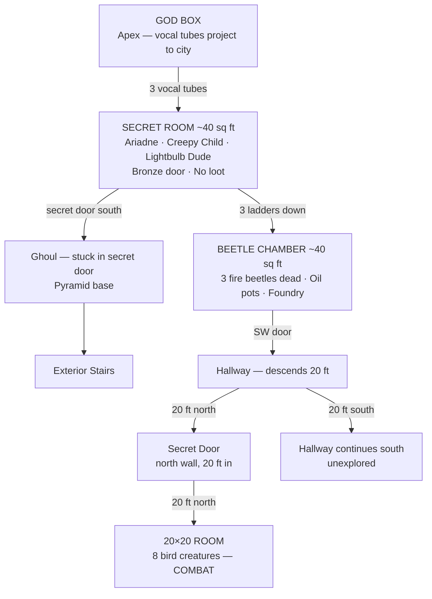

# Session ~10–11

**Date:** 2026-04-24
**Status:** In progress — being built live
**Note:** Exact session number unknown, estimated ~10–11

---

## Dungeon Overview



---

## Location: Ziggurat Interior

### Floor Plan — Upper Room (Secret Room)

```
  [god A]  [god C]  [god L]    <- apex speaker positions
     |         |        |
  +--|---------|--------|--+
  |  |         |        |  |
  | (§)       (§)      (§) |   <- left, center, right tube pillars
  | [A]       [C]      [L] |   <- Ariadne, creepy child, lightbulb dude
  |            [B]         |   <- bronze door at center pillar
  |                        |
  +--------[S]-------------+
                ^
          secret door (leads down to ghoul)
```

**Key:**
- `(§)` — hollow tube pillar with internal ladder (x3)
- `[god A/C/L]` — apex speaker position per god, aligns with pillar below
- `[B]` — bronze door at center pillar
- `[S]` — secret door, south wall
- `[A]` — Ariadne (left pillar)
- `[C]` — creepy child (center pillar)
- `[L]` — lightbulb dude (right pillar)

### Room Notes
- ~40 sq ft interior
- No loot
- Each tube pillar is hollow with a ladder — climb up to speak as a specific god
- Center tube = creepy child's god
- Each entity (Ariadne, creepy child, lightbulb dude) corresponds to one tube/god
- Bronze door at center between the three pillars
- Secret door at south wall connects to interior passage down to pyramid base
- Ghoul stuck in secret door at pyramid base (below)
- Each tube has a lower door leading to a ~40 sq ft room containing a glowing beetle (x3 rooms, one per tube)

### Pyramid Cross-Section — Ziggurat Style

```
               [GOD BOX]           <- apex, projects to city
            +_____________+
            |   tier 4    |
         +--+_____________+--+
         |      tier 3       |
         |   +--[RM]---+     |     <- secret room (party is here)
      +--+   |  | | |  |    +--+
      |       \ tubes /        |   <- 3 hollow tube pillars w/ ladders
      |    tier 2     |        |
      |   [beetle chambers]    |   <- ~40 sq ft rooms at tube bases
   +--+                        +--+
   |          tier 1               |
   |           [G]                 |   <- ghoul in secret door (base)
   +___________=====_______________+
                =====
               =======
               stairs
```

---

## Entities Present

| Entity | Notes |
|--------|-------|
| Ariadne | From Session 001 |
| Lightbulb dude | — |
| Creepy child | — |

---

## Sub-Rooms: Beetle Chambers (x3, base of each tube ladder)

### Beetle Chamber — Second Room (detailed)

```
       ┌────────────────────────────────────────────────┐                │
       │                                                │                │
       │north                                           │                │
       │                                                └────────────────┘
       │
       │
       +--------------------+────────────[W]+------------------+
       |                    |               | (§)  (§)  (§)    |
       |    20x20 room   [S]+               |              [E] |
       +--------------------+               |                  |
       ----------|<--[secret door]-20ft--+[W]+------------------+
       |
       | 20 ft N
       |
       south
       (continues)
```

**Key:**
- `[FB]` — fire beetle, alive, 2 feet long, bioluminescent
- `[p]` — clay pot
- `[W]` — door (x2, west wall)
- `[E]` — door (x1, east wall)

**Room Notes:**
- ~40 sq ft room
- Mimics layout of the secret room above
- 3 doors: 2 west, 1 east
- Fire beetles: all 3 dead — goo splattered across room
- **Loot:** 6 sacks of fire beetle goo collected (3 sacks per whole beetle, 2 beetles worth harvested) — functions as a torch
- Clay pots contain oil — mostly evaporated, used to lubricate the tube mechanisms
- Room also contains a foundry/forge with tools for repairing the mechanisms
- Beetles are 2 feet long

---

## Session Log

*(To be filled from recording transcript)*

---

## Event Log (Live)

**Thief action:** Used available oil to lubricate the god tube mechanisms. Mechanisms responded — functioned — but produced no special effect.

**Current action:** Thief checking southwest door of beetle chamber.
- Trap check: none found
- Lock check: unlocked
- Status: opened
- Beyond: hallway, descends 40 ft, turns south
- **20 ft in:** Fraxiga finds a secret door on the north wall — entered

### New Room: 20x20 Room (north of hallway, via secret door)

```
  +--------------------+
  |                    |
  |                    |
  |                    |
  |                    |
  +------------------[S]
                      ^
                 secret door entry (bottom right / SE corner)
```

**Room Notes:**
- 20x20 ft
- Entry: secret door, bottom right (SE corner)
- **COMBAT:** 8 bird creatures — initiative rolling

---

## Discoveries This Session

### The Ziggurat Vocal Tube System

The structure is a **ziggurat**. The three statue-pillars in the secret room are hollow tubes running up through the ziggurat to a **god box** at the apex. The god box receives the tubes from below and projects vocal tubes outward to the nearby city.

Each tube pillar has an internal ladder. Climbing the ladder and speaking from the top acts as that tube's designated god persona. Three tubes = three gods. The center tube belongs to the creepy child's god.

Each tube has a lower door leading to a **~40 sq ft room**. Each room contains a **glowing beetle**.

**Conclusion:** The gods heard in this region were a ruse. No actual divine presence — three separate operator positions, each impersonating a different god via the tube system.

**Triggered by:** Creepy child — examining or interacting with the child led the party to discover the tube/ladder system.
