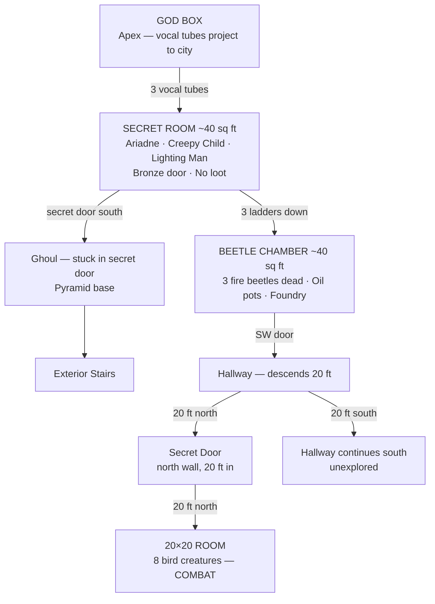

# Session ~10–11

**Date:** 2026-04-24
**Status:** In progress — being built live
**Note:** Exact session number unknown, estimated ~10–11

---

## Dungeon Overview



---

## Location: Ziggurat Interior

### Floor Plan — Upper Room (Secret Room)

```
  [god A]  [god C]  [god L]    <- apex speaker positions
     |         |        |
  +--|---------|--------|--+
  |  |         |        |  |
  | (§)       (§)      (§) |   <- left, center, right tube pillars
  | [A]       [C]      [L] |   <- Ariadne, creepy child, lighting man
  |            [B]         |   <- bronze door at center pillar
  |                        |
  +--------[S]-------------+
                ^
          secret door (leads down to ghoul)
```

**Key:**
- `(§)` — hollow tube pillar with internal ladder (x3)
- `[god A/C/L]` — apex speaker position per god, aligns with pillar below
- `[B]` — bronze door at center pillar
- `[S]` — secret door, south wall
- `[A]` — Ariadne (left pillar)
- `[C]` — creepy child (center pillar)
- `[L]` — lighting man (right pillar)

### Room Notes
- ~40 sq ft interior
- No loot
- Each tube pillar is hollow with a ladder — climb up to speak as a specific god
- Center tube = creepy child's god
- Each entity (Ariadne, creepy child, lighting man) corresponds to one tube/god
- Bronze door at center between the three pillars
- Secret door at south wall connects to interior passage down to pyramid base
- Ghoul stuck in secret door at pyramid base (below)
- Each tube has a lower door leading to a ~40 sq ft room containing a glowing beetle (x3 rooms, one per tube)

### Pyramid Cross-Section — Ziggurat Style

```
               [GOD BOX]           <- apex, projects to city
            +_____________+
            |   tier 4    |
         +--+_____________+--+
         |      tier 3       |
         |   +--[RM]---+     |     <- secret room (party is here)
      +--+   |  | | |  |    +--+
      |       \ tubes /        |   <- 3 hollow tube pillars w/ ladders
      |    tier 2     |        |
      |   [beetle chambers]    |   <- ~40 sq ft rooms at tube bases
   +--+                        +--+
   |          tier 1               |
   |           [G]                 |   <- ghoul in secret door (base)
   +___________=====_______________+
                =====
               =======
               stairs
```

---

## Entities Present

| Entity | Notes |
|--------|-------|
| Ariadne | From Session 001 |
| Lighting man | — |
| Creepy child | — |

---

## Overall Dungeon Map

### Ziggurat — Explored Areas

```
    ┌──────────────────────────────────────────+──────────────────────+──────────────+
    │                                          │                      │              │
    │                                          │                      │              │
    │ north                                    │                      [D]──────┬─────+
    │                                          +────────────[D]───────+        │
    │                                                                          │
    │                                                            +─────────────┴─────+
    └─────────┬────────────────────────[W]+------------------+   │                   │
       +──────│─────+                     |                  |   +─────┬─────────────+
       │            │                     | (§)  (§)  (§)    |         │
       │  20x20 rm  │ [S]                 |                 [E]───────[D]─────[D]────┐
       +──────│─────+                     |                  |                 │     │
    ┌─────────┤<--[secret door]-20ft--+[W]+------------------+   +────────┬────┴─────+
    │                                               +------------+        │          │
    │ 20 ft N                                       |           [D]       │          │
    │                   +───────────────────────────+           [├────────┴──────────┤
    │                   │                          [D]          [D]                 [D]
    +[D]──────────┐     │                           +------------+──────────[D]──────+
    │             │     │                           │            │                   │
    │             │     │                           │            │                   │
    │            [D]───[D]                          │            │                  [D]
    │             │     │                           │            │                   │
    │  [s]        │     │                           └────────────┤                   │
    +─────────────+     +───────────────────────────+            +───────────────────+
```

**Map Key:**
- `[D]` — door
- `[W]` / `[E]` / `[S]` — door (west / east / south wall)
- `[s]` — stairs
- `(§)` — hollow tube pillar with ladder
- `[secret door]` — concealed door

**Room Notes — Beetle Chamber:**
- ~40 sq ft, mimics layout of secret room above
- 3 doors: 2 west, 1 east
- Fire beetles: all 3 dead — goo splattered across room
- **Loot:** 6 sacks of fire beetle goo collected (3 sacks per whole beetle, 2 beetles worth harvested) — functions as a torch
- Clay pots contain oil — mostly evaporated, used to lubricate the tube mechanisms
- Room also contains a foundry/forge with tools for repairing the mechanisms
- Beetles are 2 feet long

---

## Session Log

### Arrival at Las Vegas (Sin City)

The party traveled by magnet rail train across the desert. The topography shifted over several weeks — mountains appeared in the distance, a band of light visible at night from what turned out to be the ziggurat's beacon.

At dusk, the party arrived at the ruins of **Las Vegas** (a "DEG Vegas" sign crashed nearby). The ruins: collapsed towers, stone scoured smooth by blowing sand, large metal structures toppled. In the center stood the **step pyramid (ziggurat)** with a Luxor-style beam of light shooting skyward.

A **red acidic rain** began — stinging skin, making the dogs whine. The rain forced the party toward the pyramid for cover. Ghouls were visible in the shadows of the ruins but held back by both the rain and the light from the ziggurat.

### The Ziggurat

Five stepped tiers, each approximately 20 feet high. Bottom tier largely buried in sand. On top of the highest tier: three 30-foot statues and the light beacon.

**Statues (exterior, top tier):**
- Left: strong bearded man holding a balance and a lightning bolt (**Lighting Man**)
- Center: winged child with two snakes twined about its body, holding a wand and coins (**Creepy Child**)
- Right: Ariadne — maiden, mother, and crone (the three fates — recognized from a previous adventure)

South side of the pyramid has a **ramp with stairs** from ground to the top tier.

### Secret Door (Base of Ramp)

Found at the top tier level on the side of the ramp. Held open by the **desiccated body of a ghoul** with a large crossbow bolt through its chest. The ghoul was undead, time of death indeterminate.

- Trap: large crossbow mounted on the wall opposite the door — no longer loaded (already fired, killed the ghoul)
- Beyond the door: 10-foot wide passage, dust on floor, several sets of footprints leading inward
- Door can be opened and shut from the inside; no exterior handle
- Party disposed of the ghoul body down the stairs and shut the door behind them

### The Secret Room (Top Interior — 40x40 ft)

Room smells old and musty. Dust disturbed but no clear tracks without a ranger.

**Three huge bronze cylinders** reach floor to ceiling (40 ft), positioned in the same geometric pattern as the three exterior statues above. Each cylinder has a **bronze door with a bronze handle** at floor level.

**Burt (thief) inspected all three:**
- Center cylinder (Creepy Child): no trap, door opened — ladder going up and down inside
- Ariadne cylinder (left): **trap found and disarmed** — stone slab would crush anyone opening incorrectly; ladder up and down
- Lighting Man cylinder (right): trap found and disarmed; ladder up and down (darts in wall holes)
- **75 XP × 3** awarded for trap disarmings

**Climbing up** each ladder leads inside the corresponding statue's head. Each head contains:
- A **speaking tube** (voice projects out to the city)
- **Levers and controls** to operate the statue mechanism
- Climbing up and speaking = impersonating that god to the city below

Party confirmed: the "gods" the city heard were operators using this system. A constructed deception.

**Climbing down** each ladder leads to the beetle chambers below.

### Beetle Chambers (Second Room — 40x40 ft)

One room below each cylinder. Rooms hold **spare parts for the statue machinery** and **large covered clay pots** (containing oil — mostly evaporated — used to lubricate mechanisms). Also contains a foundry/forge with repair tools.

**Fire beetles:** 2-foot long, bioluminescent (three glowing spots each). One beetle per tube base area, providing the only light in the room. Party recognized fire beetles from their very first outing.

- Beetles confirmed alive and hungry-looking
- Party killed all 3 beetles
- **Loot:** 6 sacks of fire beetle goo harvested (3 per whole beetle, 2 beetles fully harvested) — functions as a torch (bioluminescent)

Thief used remaining oil from the pots to lubricate the god tube mechanisms. Mechanisms responded and functioned but produced no special effect.

### Exploration — Southwest Door

Thief checked the SW door of the beetle chamber:
- No traps
- Unlocked
- Beyond: hallway descending, turns south after approximately 40 ft
- 20 ft into the hallway: **Fraxiga discovered a secret door** in the north wall
- Secret door leads north ~20 ft into a **20×20 room**

### 20×20 Room — Combat

Party entered the 20×20 room via the secret door (entry at SE corner).

**8 bird creatures** attacked. Initiative rolled:
1. Eric
2. Andrew
3. Brian
4. (player 4)
5. Justin
6. Snook
7. Steven (last)

*(Combat outcome to be filled from remainder of transcript)*

---

## Event Log (Live)

**Thief action:** Used available oil to lubricate the god tube mechanisms. Mechanisms responded — functioned — but produced no special effect.

**Current action:** Thief checking southwest door of beetle chamber.
- Trap check: none found
- Lock check: unlocked
- Status: opened
- Beyond: hallway, descends 40 ft, turns south
- **20 ft in:** Fraxiga finds a secret door on the north wall — entered

### New Room: 20x20 Room (north of hallway, via secret door)

```
  +--------------------+
  |                    |
  |                    |
  |                    |
  |                    |
  +------------------[S]
                      ^
                 secret door entry (bottom right / SE corner)
```

**Room Notes:**
- 20x20 ft
- Entry: secret door, bottom right (SE corner)
- **COMBAT:** 8 bird creatures — initiative rolling

---

## Discoveries This Session

### The Ziggurat Vocal Tube System

The structure is a **ziggurat**. The three statue-pillars in the secret room are hollow tubes running up through the ziggurat to a **god box** at the apex. The god box receives the tubes from below and projects vocal tubes outward to the nearby city.

Each tube pillar has an internal ladder. Climbing the ladder and speaking from the top acts as that tube's designated god persona. Three tubes = three gods. The center tube belongs to the creepy child's god.

Each tube has a lower door leading to a **~40 sq ft room**. Each room contains a **glowing beetle**.

**Conclusion:** The gods heard in this region were a ruse. No actual divine presence — three separate operator positions, each impersonating a different god via the tube system.

**Triggered by:** Creepy child — examining or interacting with the child led the party to discover the tube/ladder system.
